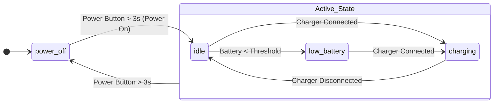
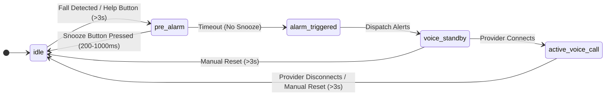
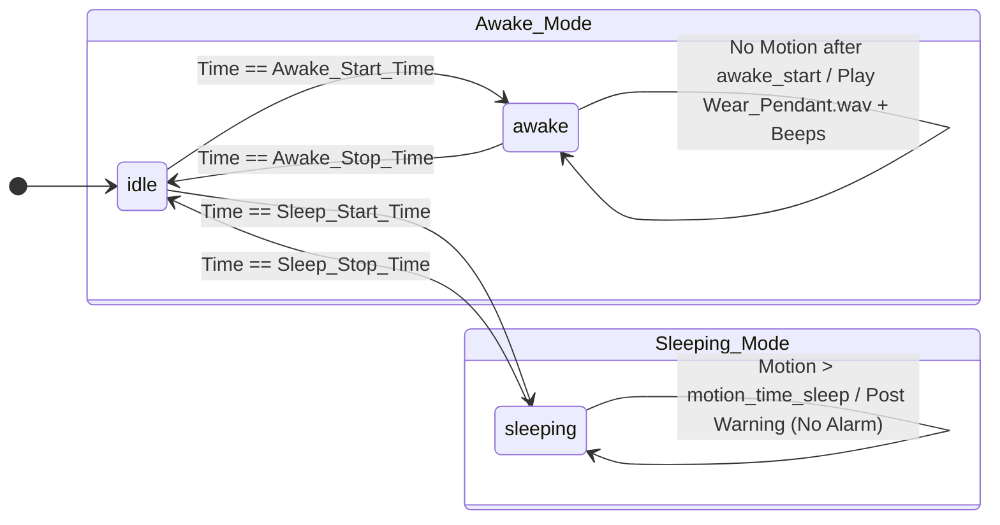

# System Requirements Specification: Smart Emergency Alert Pendant

This document details the functional, hardware, and state-machine requirements for the wearable emergency alert pendant.

---

## 1. Connectivity & Communication
*   **Network Access:** Connects to the internet via a local **home router** (Wi-Fi).
*   **Data Logging:** 
    *   Generates a continuous **device status datalog**.
    *   Transmits this log to the central server **every *x* minutes** (configurable interval).
*   **Voice Capability:** **Half-Duplex two-way voice communication** over Wi-Fi during emergency events, utilizing a remote-provider-controlled Push-To-Talk (PTT) architecture to ensure hands-free operation for the user.

---

## 2. Sensor & Input Specifications
*   **Fall Detection:** Integrated **inertial sensing** (IMU) to automatically detect fall events.
*   **Multi-Function Pushbutton Switch:**
    *   **Help Request Trigger:** Pressed and held for **$>3\text{ seconds}$**.
    *   **Pre-Alarm Snooze:** Pressed for a duration between **$200\text{ ms}$ and $1000\text{ ms}$**.
    *   **Provisioning Trigger:** Pressed and held for **$>10\text{ seconds}$** (only active when prolonged offline state is detected).
*   **Pendant Wearing Detection:** 
    *   Monitors whether the user is actively wearing the device.
    *   Triggers a warning alert based on the **time of day** if the pendant is not detected.

---

## 4. Alarm & Notification Logic
*   **Pre-Alarm Phase:**
    *   **Fall Trigger:** 
        *   Triggered by sudden IMU acceleration.
        *   Plays `Fall.wav` ("Fall detected, press the button to cancel").
        *   Dispatches a "Fall Detected" pre-alarm email.
    *   **Manual Trigger:** 
        *   Triggered by button hold ($>3\text{ seconds}$).
        *   Plays `Help_Requested.wav` ("Help request initiated, press to cancel").
        *   Dispatches a "Manual Help Requested" pre-alarm email.
*   **Snoozed Pre-Alarm:**
    *   If the user presses the button ($200\text{ ms}$ to $1000\text{ ms}$) during the pre-alarm window, the alarm is snoozed.
    *   Plays a local confirmation tone or voice prompt.
    *   Dispatches a **snoozed pre-alarm email notification** to contacts.
*   **Triggered Alarm Phase:**
    *   Occurs if the pre-alarm is **not snoozed** within the timeout window.
    *   Plays `Help_Sent.wav` ("Help request sent, please remain calm").
    *   Dispatches a **High-Priority Pushover Alert** to bypass smartphone DND, indicating an unacknowledged emergency.
*   **Emergency Voice Link Phase (Half-Duplex):**
    *   **Standby/Waiting:** Following the alarm dispatch, the system plays an audio prompt (e.g., `Voice_Wait.wav` - "Connecting to operator, please wait...") and opens a network socket for incoming audio connections.
    *   **Active Session (Hands-Free for User):** 
        *   By default, the pendant actively streams its microphone audio to the remote provider.
        *   The remote provider controls the conversation flow (Push-To-Talk). When the provider transmits audio, the pendant mutes its microphone and routes the incoming audio to the speaker.
    *   **Call Termination:** The session can be closed remotely by the provider, or locally by the user pressing and holding the main blue button for **> 3 seconds**.

---

## 5. Medicine & Appointment Reminders
*   **Synchronization:** Reads upcoming events from a designated Google Calendar.
*   **Trigger Output:** Displays the reminder text exclusively in a **maximum visibility font** (hiding standard UI elements) and emits a warning **beep every 5 seconds**.
*   **Acknowledgement:** Acknowledged by pressing and holding the side button for **> 1 second**. A `REM_ACKED` event is logged directly to the Google Sheet.
*   **Timeout:** If unacknowledged for **30 seconds**, the alert times out, normal UI resumes, and a `REM_MISSED` event is logged to the Google Sheet.

---

## 6. Power & Battery Management
*   **Battery Monitoring:** Continuous battery charging and capacity monitoring.
*   **Runtime Indicator:** Displays remaining battery life/runtime on the local UI.
*   **Low Battery Mitigation:**
    *   Triggers **low battery detection** threshold.
    *   Enters a power-saving state: **disables non-vital features** to preserve emergency functions.
    *   Pushes battery status updates directly to the local display.

---

## 7. Local Display & User Interface (UI)
The onboard local display must support the following views and features:
1.  **System Status:** Displayed immediately after pressing the **side button**.
2.  **Exclusive Reminder View:** Fully overtakes the screen with large text during an active calendar reminder.
3.  **Timekeeping:** Displays current **date and time** and appends a unique **timestamp ID** to system events.

---

## 8. Health & Routine Monitoring
*   **Pedometer:** Investigate the feasibility of integrating step-counting functionality using the existing inertial sensor.
*   **Routine Master Toggle:** All routine monitoring is enabled/disabled via a remote boolean flag (`ABILITA_VEGLIA_SONNO`).
*   **Cradle Detection (IMU + Power):** 
    *   The system validates cradle placement by checking if USB power is active AND the IMU orientation matches programmed vectors (`BASE_X_G`, `BASE_Y_G` $\pm$ `BASE_TOLLERANZA_G`).
    *   When in the cradle, all wear warnings are suppressed, and a `CRADLE_DOCKED` event can be logged to Google Sheets.
*   **Wear Detection (Awake Window):** 
    *   Active between programmable times (`ORA_INIZIO_VEGLIA` and `ORA_FINE_VEGLIA`).
    *   Monitors a $1.0\text{G}$ deadband. If continuous immobility exceeds `TIMEOUT_IMMOBILITA_MIN`, it triggers a short beep and plays `Wear_Pendant.wav`.
*   **Sleep Phase (Sleep Window):** 
    *   Active between programmable times (`ORA_INIZIO_SONNO` and `ORA_FINE_SONNO`).
    *   Tracks a "Restless Counter" for movements exceeding `SOGLIA_MOV_SONNO_G`.
    *   If the counter exceeds `MAX_MOV_SONNO` by the end of the sleep phase, an "Unusual Motion During Sleep" email is dispatched.

---

## 9. System State Machine

#### 1. Core Power & Lifecycle States
This diagram handles turning the device on/off, low battery states, and charging.

#### 2. Emergency & Alarm Flow
This diagram details what happens when a fall is detected or the manual help button is pressed.

#### 3. Time-of-Day Modes (Sleeping & Awake)
This diagram isolates the background monitoring behaviors based on the time of day.

